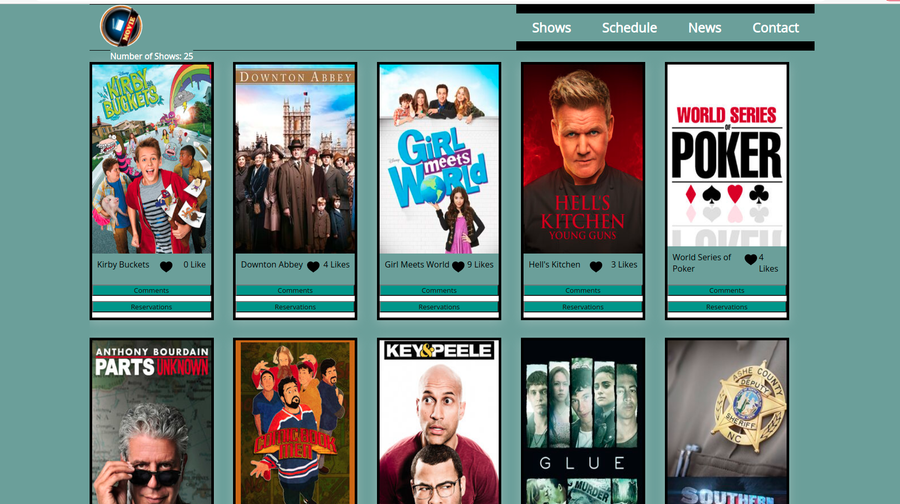

# java-capstone

It is a single page application named ibnas , we are fetching the tvMazaAPI to get all the data and displaying it on screen, the data is in the form of movies. The users can like, comments on movies and also can put reservation for future

## Screenshot of the Project
 

# Built With

- HTML
- CSS
- ES6
- WebPack

## Getting Started

To get a local copy up and running follow these simple steps.

### Prerequisites

Clone the repo using git clone https://github.com/ibrahim777764/java-capstone.git

### Install

This project is dependent on some dev packages and webpack. You need to install these packages in your local project environment to get the most of this project.

Run 'npm install' in your code terminal to install the packages. It will also install the webpack CLI.

### Usage

- Use "npm run build" to compile the webpack.

- Use "npm start" to start the app in local server.

# Authors

👤 **Ibrahim Naseer**

I am an aspiring web developer from pakistan.
- GitHub: [@ibrahimgit](https://github.com/ibrahim777764)
- Twitter: [Ibrahimtwit](https://twitter.com/Ibrahim66650696)
- LinkedIn: [@ibrahimlin](https://www.linkedin.com/in/ibrahim-naseer-215667225/)

## 🤝 Contributing

Contributions, issues, and feature requests are welcome!

Feel free to check the [issues page](../../issues/).

## Show your support

Give a ⭐️ if you like this project!
